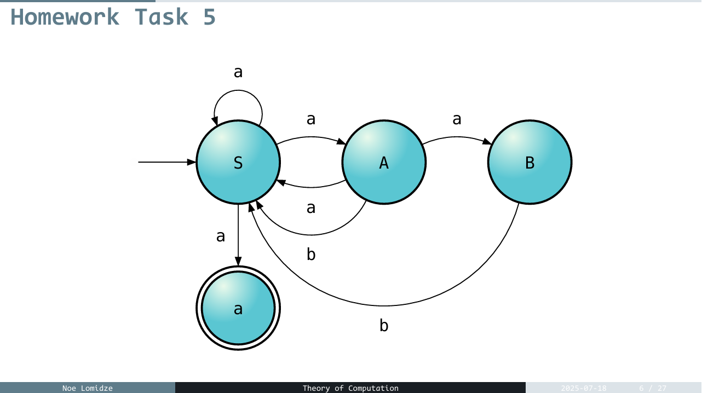
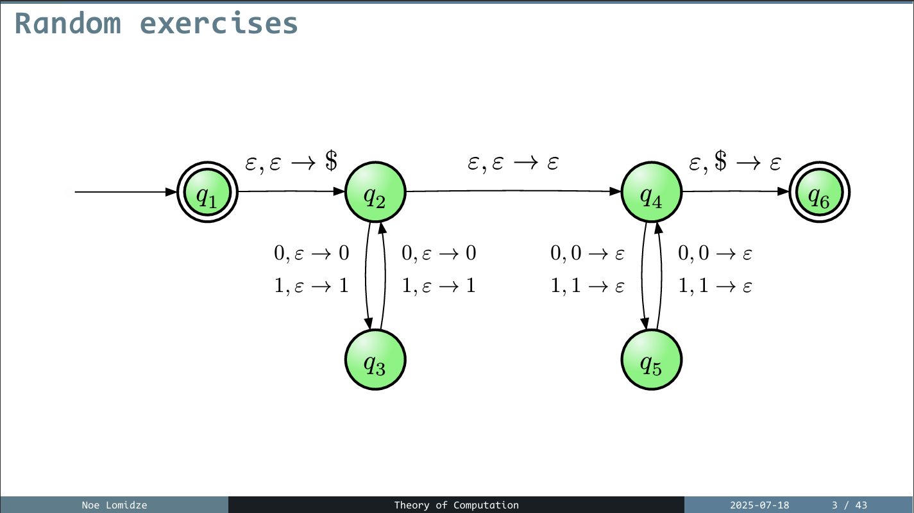

# Theory of Computation – TA Resources

This repository is just a collection of materials I’ve gathered and created as a **Teaching Assistant** for the *Theory of Computation* course. The goal is to help students understand the material better, stay organized, and have everything they need in one place..

## 📂 What's Inside

Here’s a quick overview of what you’ll find in each folder:

- **Books/** – Textbooks and reference materials I recommend or use in the course.
- **Homework/** – Homework assignments, sometimes with helpful hints.
- **Images/** – Diagrams and visuals used in explanations or slides.
- **Midterm/** – Midterm exam materials.
- **Slides/** – Lecture slides from the course.
- **TTF/** – Other useful stuff (written by me in `typst`).

## Examples below:

## 💬 Questions?

Got a question about the material or something in the repo? Reach out to me, or feel free to open an issue if you're using GitHub actively.

## 📌 Notes

- All content here is for educational use only.
- Feedback is welcome—if you find a mistake or have a suggestion, let me know.

---

